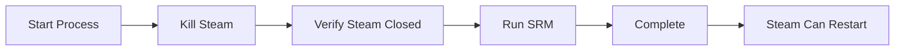

# Steam ROM Manager Automation

A simple GUI application that automates the process of updating Steam shortcuts for non-Steam games using Steam ROM Manager (SRM).

## What It Does

1. **Kills Steam processes** safely
2. **Runs Steam ROM Manager** to add/update ROM shortcuts
3. **Provides real-time feedback** through a clean GUI
4. **Handles errors gracefully** with detailed logging

Perfect for retro gaming enthusiasts who want to streamline adding emulated games to Steam.

## Features

- 🎮 **One-click automation** of the Steam + SRM workflow
- 🎨 **Modern UI** with Windows 11 theme support and dark mode
- 🔄 **Real-time progress** tracking with detailed status updates
- ⚙️ **Auto-detection** of Steam and SRM installations
- 📊 **Comprehensive logging** with colored output
- 🛠️ **Settings dialog** for easy configuration

## Screenshots


*Clean, simple interface with real-time progress tracking*

## Quick Start

### Installation

1. **Clone the repository:**
   ```bash
   git clone https://github.com/yourusername/srm-automation.git
   cd srm-automation
   ```

2. **Install dependencies:**
   ```bash
   pip install -r requirements.txt
   ```

3. **Run the application:**
   ```bash
   python main.pyw
   ```

### First Use

1. The app will auto-detect Steam ROM Manager on first launch
2. If not found, click **Settings** to set the SRM path manually
3. Click **Start Process** to begin automation
4. Watch the progress and check the log for details

## Requirements

- **Python 3.8+**
- **Windows** (Windows 10/11 recommended)
- **Steam** installed
- **Steam ROM Manager** installed
- **tkinter** (included with Python)

### Dependencies
- `pydantic-settings` - Configuration management
- `psutil` - Process management  
- `loguru` - Enhanced logging
- `platformdirs` - Platform-appropriate directories
- `sv-ttk` (optional) - Windows 11 themes
- `darkdetect` (optional) - Automatic dark mode

## Configuration

The app stores settings in the Windows user directory:
- **Windows:** `%LOCALAPPDATA%\SRM-Automation\SRM Automation\`

### Environment Variables
Override settings using environment variables with `SRM_` prefix:
```bash
SRM_THEME=dark
SRM_AUTO_START=true
SRM_LOG_LEVEL=debug
```

## How It Works



1. **Process Detection** - Finds and safely terminates Steam processes
2. **SRM Execution** - Runs Steam ROM Manager with proper timeout handling
3. **Status Reporting** - Real-time progress updates and detailed logging
4. **Error Recovery** - Graceful handling of edge cases and failures

## Project Structure

```
srm-automation/
├── main.pyw                    # Application entry point
├── config/                     # Configuration management
├── core/                       # Business logic (Steam/SRM handling)
├── ui/                         # User interface components
└── utils/                      # Utilities and logging
```

## Troubleshooting

### Common Issues

**"SRM not found"**
- Use Settings dialog to manually set Steam ROM Manager path
- Ensure SRM is installed and executable

**"Steam won't close"**
- Process continues anyway with warning
- Some Steam processes are stubborn but usually safe to proceed

**"Permission errors"**
- Run as administrator if needed
- Check file permissions on config directory

### Logs
Check `error.log` in the app directory for detailed information about any issues.

## Contributing

1. Fork the repository
2. Create a feature branch (`git checkout -b feature/amazing-feature`)
3. Commit your changes (`git commit -m 'Add amazing feature'`)
4. Push to the branch (`git push origin feature/amazing-feature`)
5. Open a Pull Request

### Development Setup

```bash
# Clone and setup
git clone https://github.com/yourusername/srm-automation.git
cd srm-automation
pip install -r requirements.txt

# Run in development mode
python main.pyw
```

## License

This project is licensed under the MIT License - see the [LICENSE](LICENSE) file for details.

## Acknowledgments

- **Steam ROM Manager** - The excellent tool this automates
- **pydantic** - For robust configuration management
- **loguru** - For beautiful logging
- **psutil** - For reliable process management
